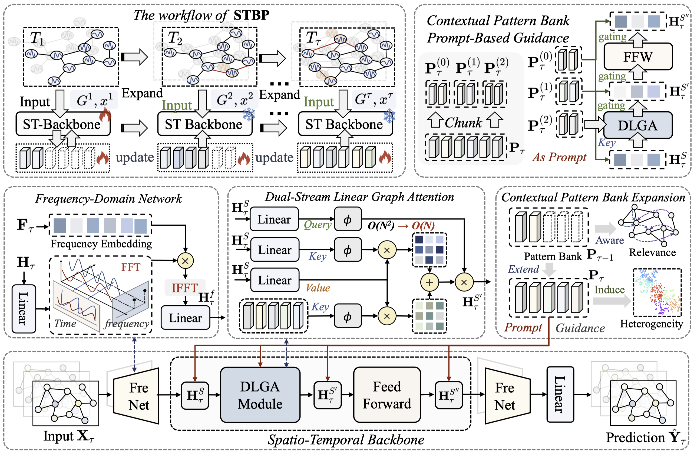
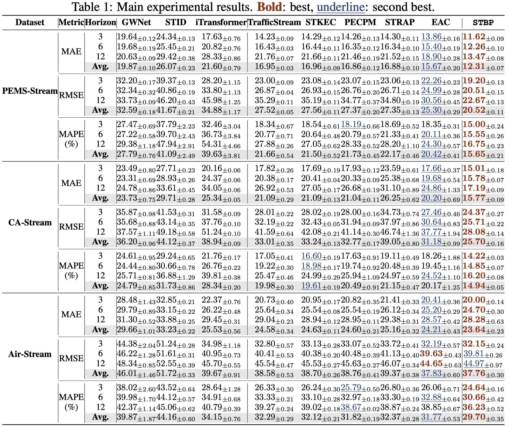
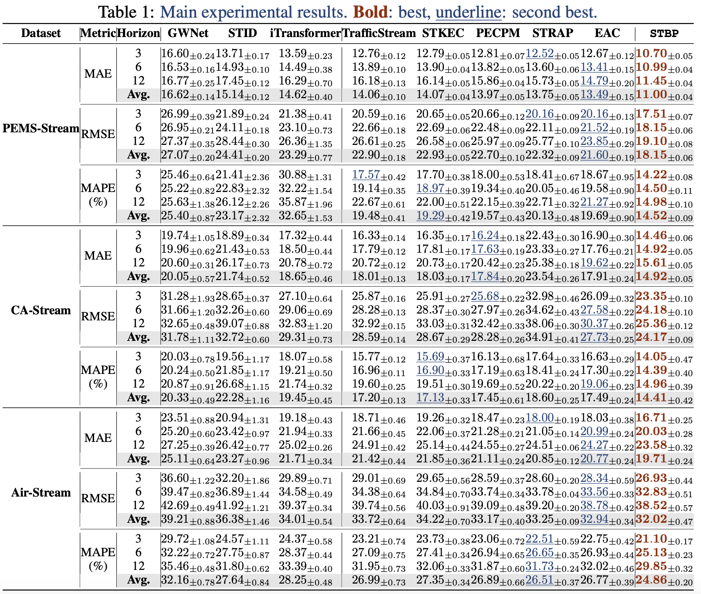

<div align="center">
  <h2><b> [ICLR'26] ✨ A General Spatio-Temporal Backbone with Scalable Contextual Pattern Bank for Urban Continual Forecasting</b></h2>
  
</div>
With the rapid growth of spatio-temporal data fueled by IoT deployments and urban infrastructure expansion, accurate and efficient continual forecasting has become a critical challenge. Most existing Spatio-Temporal Graph Neural Networks rely on static graph structures and offline training, rendering them inadequate for real-world streaming scenarios characterized by node expansion and distribution shifts. Although Continual Spatio-Temporal Forecasting methods have been proposed to tackle these issues, they often adopt backbones with limited modeling capacity and lack effective mechanisms to balance stability and adaptability. To overcome these limitations, we propose \texttt{STBP}, a novel framework that integrates a general spatio-temporal backbone with a scalable contextual pattern bank. The backbone extracts stable representations in the frequency domain and captures dynamic spatial correlations through lightweight linear graph attention. To support continual adaptation and mitigate catastrophic forgetting, the contextual pattern bank is updated incrementally via parameter expansion, enabling the capture of evolving node-level heterogeneity and relevance. During incremental training, the backbone remains fixed to preserve general knowledge, while the pattern bank adapts to new scenarios and distributions. Extensive experiments demonstrate that STBP outperforms state-of-the-art baselines in both forecasting accuracy and scalability, validating its effectiveness for continual spatio-temporal forecasting.

# 📊 Datasets
The PEMS-Stream and AIR-Stream datasets are available in the [open-source repository](https://github.com/Onedean/EAC) of our previous work, while CA-Stream can be accessed via this [link](https://drive.google.com/drive/folders/121ZB-C4ODMKPIofGAMH0EAfSFsmGmEKE?usp=sharing). We extend our sincere gratitude to the authors of the referenced datasets.

# 🚀 Installation and Quick Start

## Installation
You can directly create and import a ready-made environment:
```shell
conda env create -f environment.yaml
conda activate STBP
```
## Quick Start
It's easy to run! Here are some examples:
### PEMS-Steam
```
nohup python main.py --conf conf/STBP_PEMS.json --gpuid 0 --seed 43 > STBP_PEMS.log &
```
### CA-Steam
```
nohup python main.py --conf conf/STBP_CA.json --gpuid 0 --seed 43 > STBP_CA.log &
```
### AIR-Steam
```
nohup python main.py --conf conf/STBP_AIR.json --gpuid 0 --seed 43 > STBP_AIR.log &
```

# 🎯 Experiment
In prior work, the evaluation metrics were computed in a non-standard way, i.e., by averaging the results. Notably, this choice has little impact on our experimental conclusions, since all compared baselines follow the same practice. To align with the conventional metric computation protocol in spatiotemporal forecasting, we will report results computed in the standard way in the camera-ready version, while keeping the previous results here for reference. Please refer to `STBP/utils/metric.py` for details.

## Results
<p align="center">
  
</p>

## Previous results
<p align="center">
  
</p>

# 🔗 Acknowledgement
We greatly appreciate the following GitHub repositories for their valuable code, data, and contributions.
- [EAC](https://github.com/Onedean/EAC)
- [LargeST](https://github.com/liuxu77/LargeST)
- [TrafficStream](https://github.com/AprLie/TrafficStream)
- [STKEC](https://github.com/wangbinwu13116175205/STKEC)
