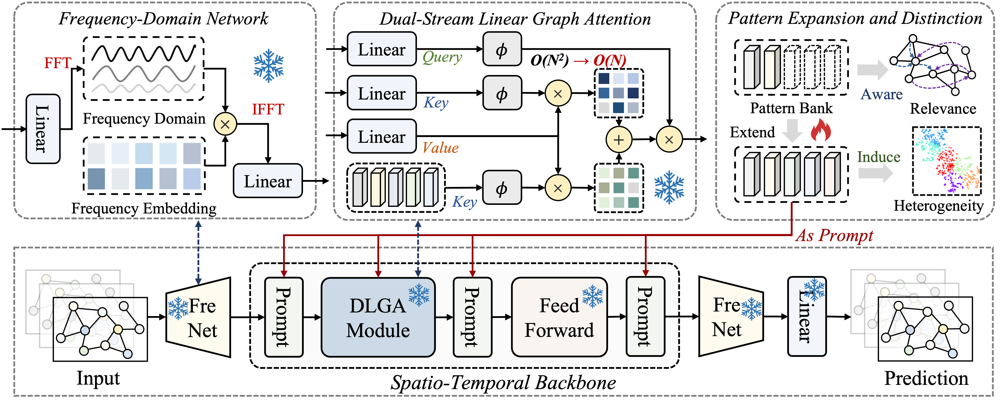
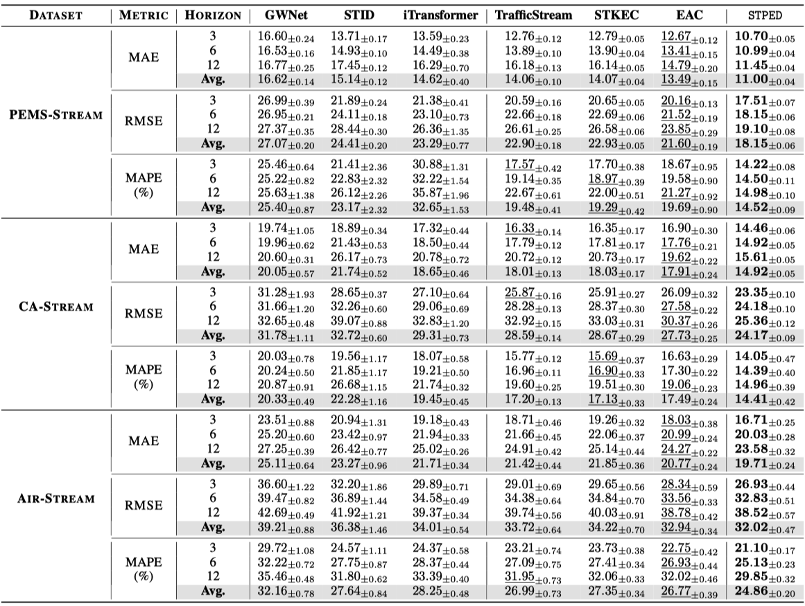

<div align="center">
  <h2><b> ✨ A General Spatio-Temporal Backbone with Scalable Contextual Pattern Bank for Urban Continual Forecasting</b></h2>
  
</div>
With the explosive growth of spatio-temporal data driven by IoT deployments and urban infrastructure expansion, accurate and efficient incremental forecasting has become a critical challenge. Recent Spatio-Temporal Graph Neural Networks assume static graph topologies and temporal scales, making them ill-suited for dynamic real-world data streams. Meanwhile, existing continual learning methods often adopt simple backbones, limiting their ability to capture evolving dependencies and adapt to distributional drift. To address these limitations, we propose STBP, a novel framework for Continual Spatio-Temporal Forecasting that bridges the gap between STGNNs and continual learning. STBP integrates a general-purpose spatio-temporal backbone with a scalable contextual pattern bank. The backbone extracts stable spatio-temporal representations in the frequency domain and models dynamic spatial correlations using linear graph attention. To support continual adaptation and alleviate catastrophic forgetting, the contextual pattern bank is incrementally updated via parameter expansion, capturing evolving node-level heterogeneous patterns. During incremental training, the backbone remains frozen to preserve general knowledge, while the pattern bank adapts to new scenarios and distributions. Extensive experiments show that STBP surpasses state-of-the-art baselines in both accuracy and scalability, underscoring its effectiveness for continual spatio-temporal forecasting.

# 📊 Datasets
PEMS-Stream and AIR-Stream can be accessed through the open-source [links](https://github.com/Onedean/EAC) of previous work, while CA-Stream will be made open-source after acceptance. We extend our sincere gratitude to the authors of the referenced datasets.

# 🚀 Installation and Quick Start

## Installation
You can directly create and import a ready-made environment:
```shell
conda env create -f environment.yaml
conda activate STBP
```
## Quick Start
It's easy to run! Here are some examples:
### PEMS-Steam
```
nohup python main.py --conf conf/STBP_PEMS.json --gpuid 0 --seed 43 > STBP_PEMS.log &
```
### CA-Steam
```
nohup python main.py --conf conf/STBP_CA.json --gpuid 0 --seed 43 > STBP_CA.log &
```
### AIR-Steam
```
nohup python main.py --conf conf/STBP_AIR.json --gpuid 0 --seed 43 > STBP_AIR.log &
```

# 🎯 Results
<p align="center">
  
</p>

# 🔗 Acknowledgement
We greatly appreciate the following GitHub repositories for their valuable code, data, and contributions.
- [EAC](https://github.com/Onedean/EAC)
- [LargeST](https://github.com/liuxu77/LargeST)
- [TrafficStream](https://github.com/AprLie/TrafficStream)
- [STKEC](https://github.com/wangbinwu13116175205/STKEC)
